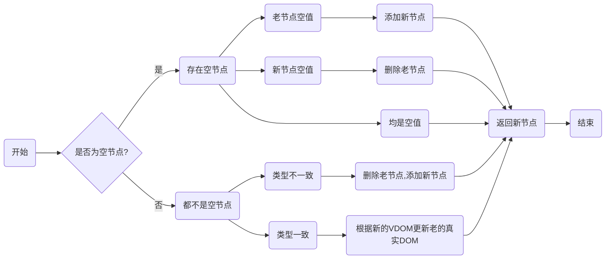
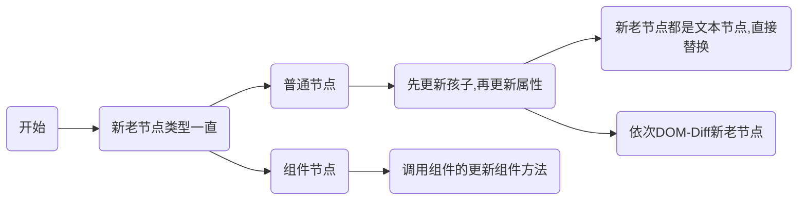
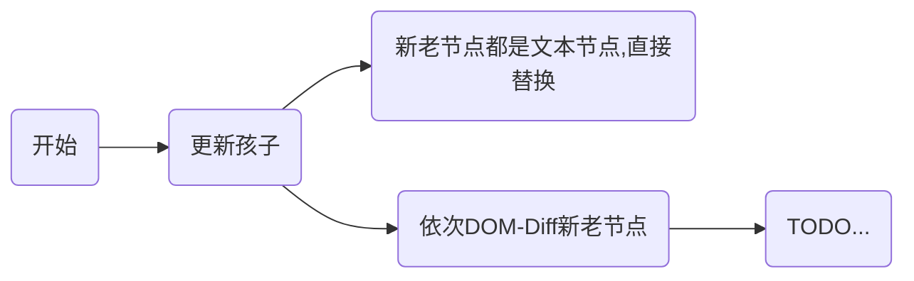

# 全面拥抱DOM-Diff

> 灵魂拷问1：DOM-Diff比对的是啥？
> 回答：当然是**虚拟DOM**呀！

> 灵魂拷问2：那虚拟DOM都有啥属性？
> 回答：好像有**type**，**props**，**ref**...

> 灵魂拷问3：如何判断两个节点是否一样？
> 回答：**判断空值**呗，如果新老节点其中有一个为空，那肯定不一样；还有就是**判断type**呗，类型不一样，那肯定不一样；如果类型一致，应该要**判断props的孩子和属性**囖，其中一个不一样，那肯定不一样。那还有吗？...

> 灵魂拷问4：当比对的虚拟DOM类型一致时，普通节点（文本节点或标签节点）和组件节点的比对方式一样吗？
> 回答：当然不一样啦。因为普通节点可能只需要简单替换，如果普通节点有孩子有属性，则递归对比更新孩子和更新属性后，普通节点就处理完成了；但是，组件节点不同，这需要考虑类组件的生命周期、类组件是否批量更新以及计算最终组件状态，不能简单对比更新孩子和属性就完事了。

> 灵魂拷问5：如何进行比对并且更新孩子节点？
>
> 回答：如果新老节点的孩子都是文本节点则直接替换，如果不是，依次比对（TODO）

## 简版DOM-Fiff

> 为什么有这个简版？完全是因为我还没有接触过DOM-Diff，所以只好先整理简版的啦...

### 比较新老节点

*注意1：删除老节点的时候，如果是类组件，应该调用生命周期`componentWillUnmount`函数*

### 根据新节点更新老节点

*注意一：调用组件的更新组件方法时，应该调用生命周期`componentWillReceiveProps`函数*

### 更新孩子

